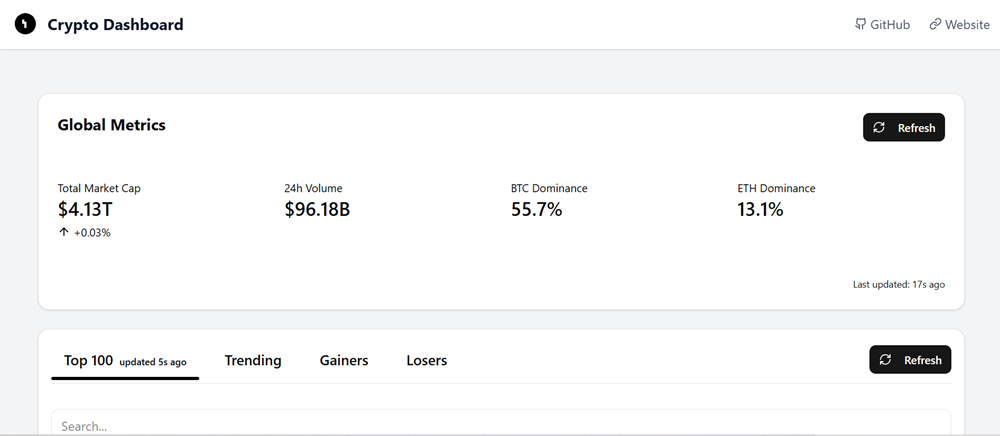
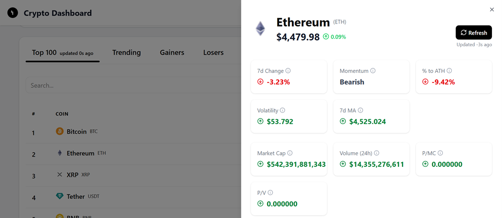
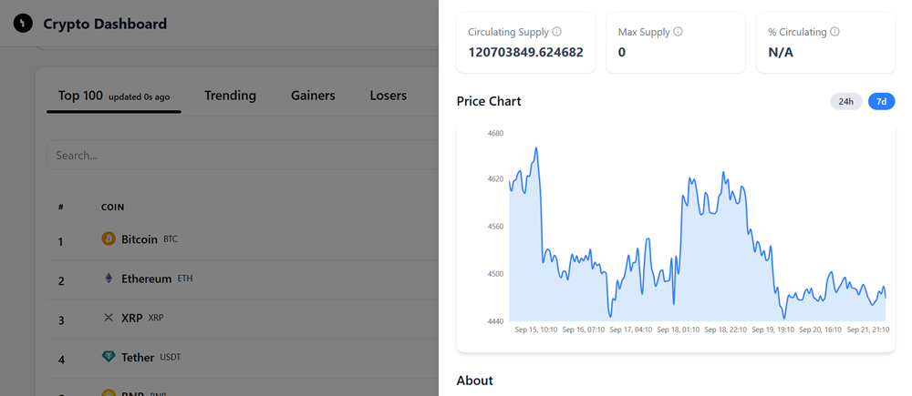

# Crypto Dashboard

A **real-time cryptocurrency dashboard** built with **Next.js 15** that displays market data using the **CoinGecko API**. Users can select a cryptocurrency to view key metrics such as price, market cap, volume, and historical trends. The UI is built using **shadcn/ui** for modern and responsive components.

---

## Features

- **Coin Tabs Section**  
  Users can switch between _Top 100, Trending, Gainers, and Losers_. Features include:

  - Dynamic fetching from `/api` routes
  - Refresh button for real-time updates
  - Search by coin name or symbol
  - Error handling and loading states
  - Select a coin to open detailed view

- **Coin Sheet Modal**  
  Opens when a coin is selected, showing:

  - **Price metrics**: current price, 24h & 7d change, momentum
  - **Market data**: market cap, 24h volume, price-to-market cap, price-to-volume
  - **Supply data**: circulating supply, max supply, % circulating, % to ATH
  - **Interactive 7-day price chart** using a custom `AreaChart` component
  - **About & Community links**: all-time high/low, rank, developer score, website, Twitter, Reddit
  - Retry mechanism for chart and data fetch errors

- **Responsive & Interactive UI**  
  Built entirely with **shadcn/ui** components like `Card`, `Sheet`, `AreaChart`, and more.

---

## Screenshots

### Dashboard Overview  


### Coin Sheet Modal  





## Tech Stack

- **Frontend**: Next.js 15, React, TypeScript
- **UI**: shadcn/ui components, TailwindCSS
- **Charts**: Custom `AreaChart` wrapper around Chart.js
- **API**: CoinGecko API (no API key required)
- **Deployment**: Vercel, Netlify, or any Node.js host

---

## Getting Started

### Prerequisites

- Node.js >= 20
- NPM or Yarn

### Installation

```bash
git clone https://github.com/harranali/crypto-dashboard.git
cd crypto-dashboard
npm install
# or
yarn install
```

### Run the Project

```bash
npm run dev
# or
yarn dev
```

Open [http://localhost:3000](http://localhost:3000) in your browser to view the dashboard.

## License

MIT License
